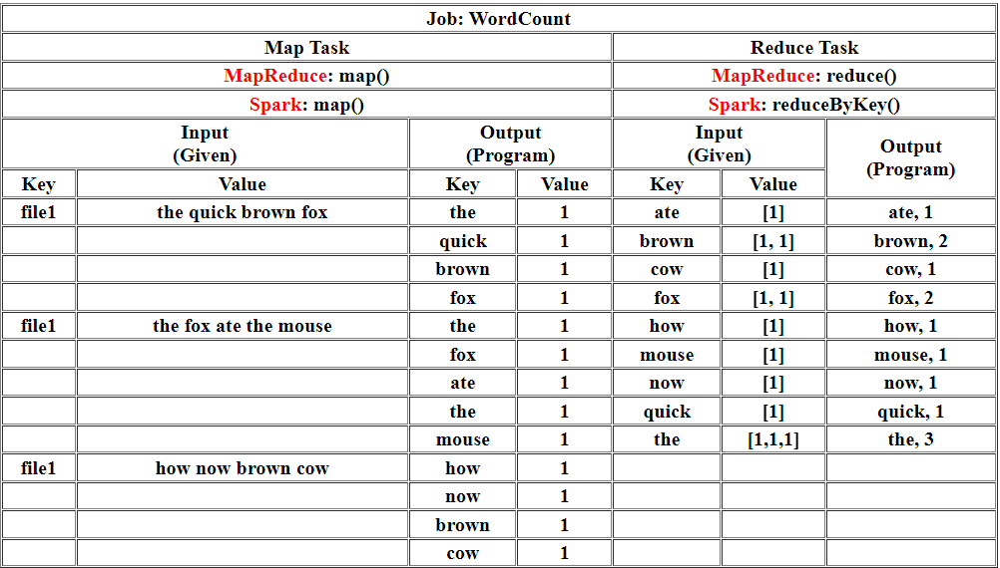
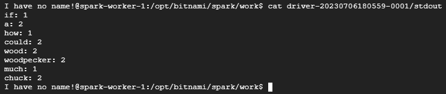
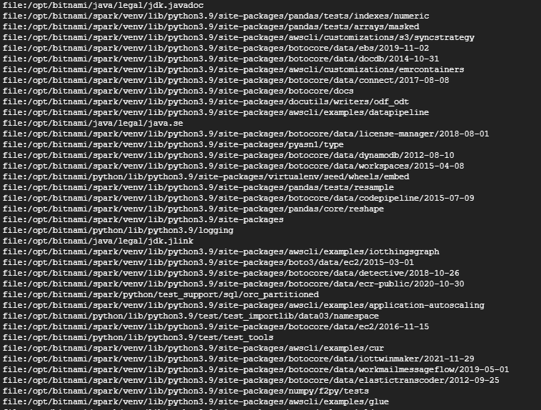

# WordCount And PageRank
The objective of this guide is to provide clear and concise instructions for performing word count and PageRank using Kubernetes on Google Cloud Platform (GCP). By following the steps outlined in this guide, users will be able to set up the required environment, deploy Spark applications on a Kubernetes cluster, and execute word count and PageRank algorithms on large-scale datasets. 

[WordCount & PageRank (Google Slides)] (https://docs.google.com/presentation/d/1gILlH2dCP49LU1SN5EEWO4JpuGSVQQlj-jsV1NcI2lg/edit?usp=sharing)

## Introduction

* <b>Word Count:</b>
The word count algorithm involves counting the occurrences of each unique word in a given text or document. With Spark's parallel processing capabilities, the word count operation can be distributed across multiple nodes in the Kubernetes cluster for faster and efficient execution.
* <b> PageRank: </b>
PageRank is an algorithm used to measure the importance of web pages in search engine ranking. It assigns a numerical weight to each page based on the number and quality of incoming links. By utilizing Spark's distributed computing capabilities, the PageRank algorithm can be applied to a large graph of web pages to determine the relative importance of each page.

## Design

<h3> </b> WordCount </b> </h3>


<h3> </b> PageRank </b> </h3>
The Process of Calculating PageRank :

* Initialize each page's rank to 1.0:

At the beginning of the algorithm, assign an initial rank of 1.0 to every page in the web graph.

* Iterative contribution calculation :

On each iteration, each page (p) sends a contribution of rank(p) divided by the number of neighbors (pages it has links to) to its neighbors.
The contribution represents the proportion of the current page's rank that it distributes to its neighboring pages.
* Update each page's rank :

After receiving contributions from its neighbors, each page's rank is updated using the formula: rank = 0.15 + 0.85 * contributionsReceived.

**Note:**

The damping factor of 0.85 is applied to balance the contribution of incoming ranks with the base rank of 0.15.

The damping factor ensures that not all the rank is distributed, helping to avoid overemphasis on highly connected pages.

The more Input Web Pages the better.

The higher PageRank of an Input Web Page the better.
<hr>

# Implementation 

1. Click on activate cloud shell. Authenticate with Google Cloud Platform (GCP)
If you encounter an authentication error, run the command:
```
gcloud auth login
```
This command will open a web page where you can authenticate and obtain new credentials.
Follow the on-screen instructions to complete the authentication process.
Click on the click, authorize, and copy the code. Paste the same code in the authentication
code.
2. Add the Helm stable repository:
```
$ helm repo add stable https://charts.helm.sh/stable
```
3. Install the NFS server provisioner using Helm:
```
$ helm install nfs stable/nfs-server-provisioner \
    --set persistence.enabled=true,persistence.size=5Gi
```

4. Create a spark-pvc.yaml file. (Added in this repository)
```
$ vim spark-pvc.yaml
```

5. Apply the PersistentVolumeClaim (PVC) using the following command:
```
$ kubectl apply -f spark-pvc.yaml
```

6. Copy the Spark examples JAR file to a local directory using Docker:
```
$ docker run -v /tmp:/tmp -it bitnami/spark -- find /opt/bitnami/spark/examples/jars/ -name spark-examples* -exec cp {} /tmp/my.jar \;
```
7. Create a test file with a sample text:

```
$ echo "how much wood could a woodpecker chuck if a woodpecker could chuck wood" > /tmp/test.txt
```
8. Copy the JAR file and test file to the Spark data pod:
```
$ kubectl cp /tmp/my.jar spark-data-pod:/data/my.jar
$ kubectl cp /tmp/test.txt spark-data-pod:/data/test.txt
```
9. Create a spark-chart.yaml file(Added in this repository)
```
vim-spark-chart.yaml
```
10. Add the Bitnami Helm repository:
```
$ helm repo add bitnami https://charts.bitnami.com/bitnami
```

11. Install Spark using Helm with the provided configuration:
```
$ helm install spark bitnami/spark -f spark-chart.yaml
```

12. Get the external IP address of the Spark service:
```
$ kubectl get svc -l "app.kubernetes.io/instance=spark,app.kubernetes.io/name=spark"
```

## Finding WordCount

1. Run the Spark client using kubectl to submit a word count job:

```
$ kubectl run --namespace default spark-client --rm --tty -i --restart='Never' \
    --image docker.io/bitnami/spark:3.4.1-debian-11-r3 \
    -- spark-submit --master spark://<SPARK_MASTER_IP>:7077 \
    --deploy-mode cluster \
    --class org.apache.spark.examples.JavaWordCount \
    /data/my.jar /data/test.txt
```

Note: Try to use the latest spark version. Otherwise you might encounter an error.

Replace <SPARK_MASTER_IP> with the Spark master's IP address obtained in previously.

2. Get the name of the Spark worker pod:
```
$ kubectl get pods -o wide | grep <SPARK_WORKER_IP>
```
Replace <SPARK_WORKER_IP> with the IP address obtained in previous step.

3. Enter the Spark worker pod:
```
$ kubectl exec -it spark-worker-1 -- bash
```

4. Navigate to the Spark work directory:

I have no name!@spark-worker-1:/opt/bitnami/spark
```
$ cd /opt/bitnami/spark/work

```

5. View the output file generated by the word count job:
```
cat <Submission ID >/stdout
```
<Submission_Id> is the driver id the completed driver you can get from external IP.

Output:

## PageRank

1. Access the Spark master pod:

```
$ kubectl exec -it spark-master-0 -- bash
```

2. Navigate to the Python examples directory:

I have no name!@spark-master-0:/opt/bitnami/spark$ 
```
cd /opt/bitnami/spark/examples/src/main/python
```

3. Submit the PageRank job using spark-submit:
```
spark-submit pagerank.py /opt 2
```
These will execute the PageRank algorithm on the provided input data (/opt directory) with a specified number of iterations (2).

Output:



